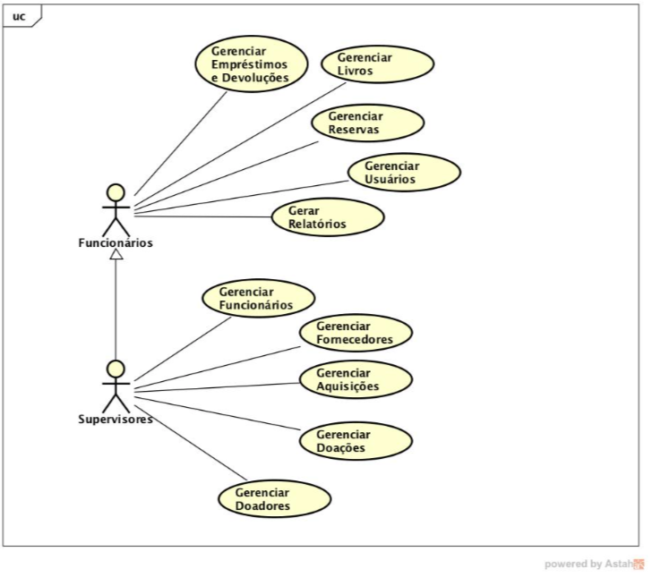

# UML Use Case Diagram (Library System)

OVERVIEW
--------------------------------------------------
This is an UML use case diagram project of a library system for the [Oriented Object Project and Analysis] course. The purpose of the project was to make a monography with a use case diagram, description of the use cases and to learn how to use a Computer-Aided Software Engineering (CASE) application. It was made at the Computer Science undergraduate program from University of São Paulo (ICMC - USP).

REQUIREMENTS DOCUMENT
--------------------------------------------------
```bash
  1) Elaborate a Use Case Diagram of the system along with a table associating the use cases with the respective requirements covered.
  2) In the same table of item 1, describe all use cases in a summarized way.
  3) Describe the Use Cases in Abstract Full format for at least three use cases.
```
* Please check the file `Requirements Document.pdf` for a complete description of the project.

REQUIREMENTS DOCUMENT PURPOSE
--------------------------------------------------
The purpose of this requirements specification document is to define all the requirements of the Library System, whose main purpose is to control all the movement of books in a library as well as to assist the employees in the administration of all the librarian's users.

SCOPE
--------------------------------------------------
The Librariy System allows the registration and consultation of books that are acquired by the library, maintaining a history of all loans and returns already made and storing current information regarding outstanding loans, books and reserves, which can be consulted at any time by system user.

COMPUTER-AIDED SOFTWARE ENGINEERING APPLICATION
--------------------------------------------------
For this project it was used Astash* which is an UML modelling tool.

EXAMPLES
--------------------------------------------------



CREDITS
--------------------------------------------------
- Aulos Plautius Martines Marino
- Bruno Pinto Ferraz Fabbri
- Henrique Pasquini Santos
- Renato Zane
- Wesley Tiozzo

MORE INFO
--------------------------------------------------
* Please check the files: `project report.pdf` and `Requirements Document.pdf`
* CASE Software: <https://en.wikipedia.org/wiki/Computer-aided_software_engineering>
* UML Use Case Diagram: <https://en.wikipedia.org/wiki/Use_case_diagram>
* Astash software: <https://en.wikipedia.org/wiki/Astah*>
